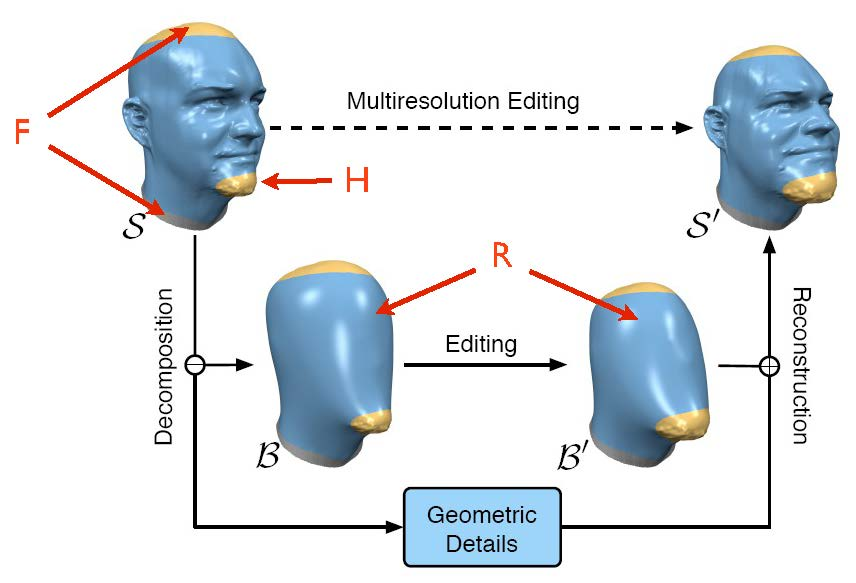

# Assignment 5: Shape Deformation

In this exercise, you will implement an algorithm to interactively deform 3D models. You will construct a two-level multi-resolution surface representation and use naive Laplacian editing to deform it.

---
## Multiresolution mesh editing
For this task, you will compute a mesh deformation based on the rotations and translations applied interactively to a subset of its vertices via the mouse. Let  be the set of "handle" vertices that the user can manipulate (or leave fixed). We want to compute a deformation for the remaining vertices, denoted as .

Let  be our input surface, represented as a triangle mesh. We want to compute a new surface that contains:
- the vertices in  translated/rotated using the user-provided transformation , and
- the vertices in  properly deformed using the algorithm described next.

The algorithm is divided in three phases:

1. removing high-frequency details,
2. deforming the smooth mesh, and
3. transferring high-frequency details to the deformed surface.

*Fig. 1: Algorithm Overview*

### Selecting the handles
A minimal sphere-based interface for selecting vertices has been implemented in `Selection.ipynb`.
To use it, execute the cell with widgets, and select numbered keys to specify the segment index (`+` key to add more).
Use sliders to adjust the position and radius of the selector sphere, and `Paint!` to mark the current segment.
Finally, the accepted segments are stored in the variable `segments_recording`,
which you can save as `npy` file for the next tasks. There are several prepared file with suffix `.label.npy` in the `data/` folder.

*Note*: the array `seg` stored is of integer type, with values 0,1,2,... where `seg==0` indicates the free vertices, `seg==1` means the first selected segment and so on.

In `Assignment5.ipynb`, another interface is provided to specify the displacement and rotation. 
The dropdown menu specifies which segement is being manipulated, and the slider 
specifies the displacement `x,y,z` and rotation `α,β,γ`, the updated vertex positions are stored in `handle_vertex_positions`.

*Note*: within `handle_vertex_positions`, only the entries corresponding to selections (`seg>0`) are supposed to be used.

---
### Step 1: Removal of high-frequency details

 

 

 

*Fig. 2: Input and Smoothed Meshes*

We remove the high-frequency details from the vertices  in  by minimizing the thin-plate energy, which involves solving a bi-Laplacian system arising from the quadratic energy minimization:

<!-- 
\begin{aligned} \min_\textbf{v} & \quad\textbf{v}^T \textbf{L}_\omega \textbf{M}^{-1} \textbf{L}_\omega \textbf{v} \\
 \text{subject to}&
 \quad \textbf{v}_H = \textbf{o}_H,
\end{aligned}
-->

where  are the handle 's vertex positions,  is the cotan Laplacian of , and  is the mass matrix of .
Notice that  is the symmetric matrix consisting of the cotangent weights ONLY (without the division by Voronoi areas). In other words, it evaluates an "integrated" Laplacian rather than an "averaged" laplacian when applied to a vector of vertices. The inverse mass matrix appearing in the formula above then applies the appropriate rescaling so that the laplacian operator can be applied again (i.e., so that the Laplacian value computed at each vertex can be interpreted as a piecewise linear scalar field whose Laplacian can be computed).
This optimization will produce a mesh similar to the one in Figure 2. Note that the part of the surface that we want to deform is now free of high-frequency details. We call this mesh .

*Relevant `scipy` functions:* `scipy.sparse.csc_matrix`, `scipy.sparse.diags`, 

---
### Step 2: Deforming the smooth mesh
 

 

*Fig. 3: Deformed/Smoothed Meshes*

The new deformed mesh is computed similarly to the previous step, by solving the minimization:

<!-- $$ 
\begin{aligned} \min_\textbf{v}& \quad \textbf{v}^T \textbf{L}_\omega \textbf{M}^{-1} \textbf{L}_\omega \textbf{v} \\
 \text{subject to}&
 \quad \textbf{v}_H = t(\textbf{o}_H),
\end{aligned}
$$ -->
where  are the new handle vertex positions after applying the user's transformation. We call this mesh .

*Relevant `scipy` functions:* `scipy.sparse.linalg.spsolve` 

---
### Step 3: Transferring high-frequency details to the deformed surface
 

 

 

*Fig 4: Displacements on  (left) and  (right)*

The high-frequency details on the original surface are extracted from  and transferred to . We first encode the high-frequency details of  as displacements w.r.t. .
We define an orthogonal reference frame on every vertex  of  using:
1. The unit vertex normal
2. The normalized projection of one of 's outgoing edges onto the tangent plane defined by the vertex normal. A stable choice is the edge whose projection onto the tangent plane is longest.
3. The cross-product between (1) and (2)

For every vertex , we compute the displacement vector that takes  from  to  and represent it as a vector in 's reference frame. 
For every vertex of , we also construct a reference frame using the normal and the SAME outgoing edge we selected for  (not the longest in ; it is important that the edges used to build both reference frames are the same). We can now use the displacement vector components computed in the previous paragraph to define transferred displacement vectors in the new reference frames of . See Figure 4 for an example.
Applying the transferred displacements to the vertices of  generates the final deformed mesh . See Figure 5 for an example.

 

*Fig 5: Final Deformation Results*

Recommended outputs:
- Provide screenshots for 4 different deformed meshes. For each example, provide a rendering of , ,  and .

---
## Performance (Optional, Bonus 5%)
To achieve real-time performance, you must prefactor the sparse bi-Laplacian matrix appearing in both linear systems. After the user specifies vertex sets  and , you can factorize the matrix  (using a Cholesky "" factorization) and then re-use the factorization to solve both linear systems efficiently. This is an optional part of the exercise; if your implementation does not achieve interactive frame-rates (10+ fps) on the gingerbread mesh, it will not receive the full score. This might require additional vectorizations.

*Available Packages*: `scikit-sparse`, `numba`.
*Relevant functions*: `sksparse.cholmod`, `numba.jit`, `numpy.einsum`, `scipy.sparse.linalg.splu`

---
